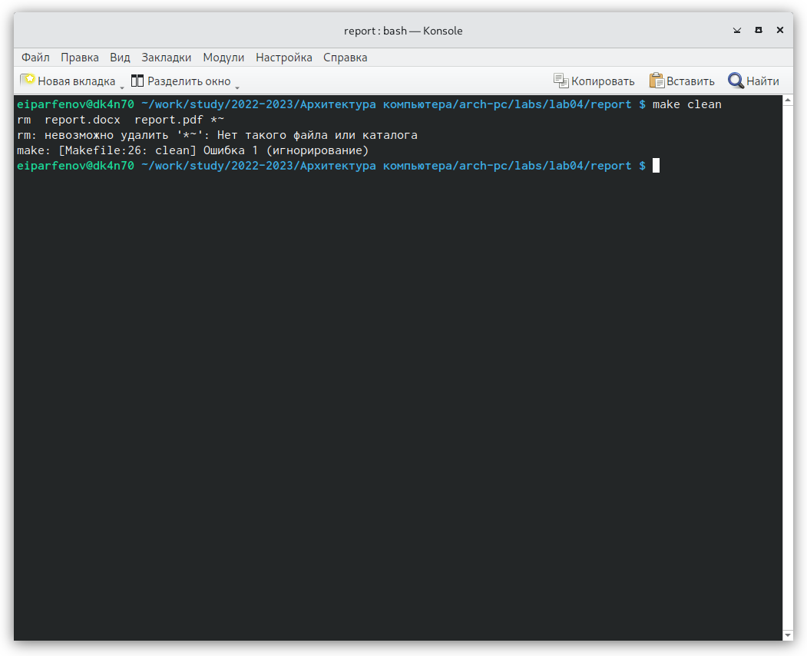

---
## Front matter
title: "Отчёт по лабораторной работе №4"
subtitle: "Язык разметки Markdown"
author: "Парфенов Емельян Игоревич"

## Generic otions
lang: ru-RU
toc-title: "Содержание"

## Bibliography
bibliography: bib/cite.bib
csl: pandoc/csl/gost-r-7-0-5-2008-numeric.csl

## Pdf output format
toc: true # Table of contents
toc-depth: 2
lof: true # List of figures
lot: true # List of tables
fontsize: 12pt
linestretch: 1.5
papersize: a4
documentclass: scrreprt
## I18n polyglossia
polyglossia-lang:
  name: russian
  options:
	- spelling=modern
	- babelshorthands=true
polyglossia-otherlangs:
  name: english
## I18n babel
babel-lang: russian
babel-otherlangs: english
## Fonts
mainfont: PT Serif
romanfont: PT Serif
sansfont: PT Sans
monofont: PT Mono
mainfontoptions: Ligatures=TeX
romanfontoptions: Ligatures=TeX
sansfontoptions: Ligatures=TeX,Scale=MatchLowercase
monofontoptions: Scale=MatchLowercase,Scale=0.9
## Biblatex
biblatex: true
biblio-style: "gost-numeric"
biblatexoptions:
  - parentracker=true
  - backend=biber
  - hyperref=auto
  - language=auto
  - autolang=other*
  - citestyle=gost-numeric
## Pandoc-crossref LaTeX customization
figureTitle: "Рис."
tableTitle: "Таблица"
listingTitle: "Листинг"
lofTitle: "Список иллюстраций"
lotTitle: "Список таблиц"
lolTitle: "Листинги"
## Misc options
indent: true
header-includes:
  - \usepackage{indentfirst}
  - \usepackage{float} # keep figures where there are in the text
  - \floatplacement{figure}{H} # keep figures where there are in the text
---

# Цель работы

Освоение процедуры оформления отчетов с помощью легковесного языка разметки Markdown. 

# Теоретическое введение

Markdown - облегчённый язык разметки, созданный с целью обозначения форматирования в простом тексте, с максимальным сохранением его читаемости человеком, и пригодный для машинного преобразования в языки для продвинутых публикаций. Этот отчет сделан с помощью Markdown.

# Выполнение лабораторной работы

1. Открываю терминал. (рис. [-@fig:001])

{ #fig:001 width=70% }

2. Перехожу в каталог курса. (рис. [-@fig:002])

{ #fig:002 width=70% } 

3. Обновляю локальный репозиторий с помощью git pull. (рис. [-@fig:003]) 

{ #fig:003 width=70% }

4. Перехожу в report. (рис. [-@fig:004]) 

{ #fig:004 width=70% }

5. Провожу компиляцию шаблона с использованием Makefile. (рис. [-@fig:005]) 

{ #fig:005 width=70% }

6. Проверяю наличие файлов. (рис. [-@fig:006]) 

{ #fig:006 width=70% }

7. Удаляю полученные файлы. (рис. [-@fig:007]) 

{ #fig:007 width=70% }

8. Проверяю. (рис. [-@fig:008]) 

{ #fig:008 width=70% }

9. Открываю файл report.md c помощью gedit. (рис. [-@fig:009])

{ #fig:009 width=70% }

10. Заполняю отчет. (рис. [-@fig:010])

{ #fig:010 width=70% }

11. Компилирую отчет с использованием Makefile. (рис. [-@fig:011])

{ #fig:011 width=70% }

# Выводы

Освоил процедуры оформления отчетов с помощью легковесного языка разметки Markdown. 

::: {#refs}
:::
