---
## Front matter
title: "Отчёт по лабораторной работе №5"
subtitle: "Язык разметки Markdown"
author: "Парфенов Емельян Игоревич"

## Generic otions
lang: ru-RU
toc-title: "Содержание"

## Bibliography
bibliography: bib/cite.bib
csl: pandoc/csl/gost-r-7-0-5-2008-numeric.csl

## Pdf output format
toc: true # Table of contents
toc-depth: 2
lof: true # List of figures
lot: true # List of tables
fontsize: 12pt
linestretch: 1.5
papersize: a4
documentclass: scrreprt
## I18n polyglossia
polyglossia-lang:
  name: russian
  options:
	- spelling=modern
	- babelshorthands=true
polyglossia-otherlangs:
  name: english
## I18n babel
babel-lang: russian
babel-otherlangs: english
## Fonts
mainfont: PT Serif
romanfont: PT Serif
sansfont: PT Sans
monofont: PT Mono
mainfontoptions: Ligatures=TeX
romanfontoptions: Ligatures=TeX
sansfontoptions: Ligatures=TeX,Scale=MatchLowercase
monofontoptions: Scale=MatchLowercase,Scale=0.9
## Biblatex
biblatex: true
biblio-style: "gost-numeric"
biblatexoptions:
  - parentracker=true
  - backend=biber
  - hyperref=auto
  - language=auto
  - autolang=other*
  - citestyle=gost-numeric
## Pandoc-crossref LaTeX customization
figureTitle: "Рис."
tableTitle: "Таблица"
listingTitle: "Листинг"
lofTitle: "Список иллюстраций"
lotTitle: "Список таблиц"
lolTitle: "Листинги"
## Misc options
indent: true
header-includes:
  - \usepackage{indentfirst}
  - \usepackage{float} # keep figures where there are in the text
  - \floatplacement{figure}{H} # keep figures where there are in the text
---

# Цель работы

Освоение процедуры компиляции и сборки программ, написанных на ассемблере NASM.

# Теоретическое введение

Markdown - облегчённый язык разметки, созданный с целью обозначения форматирования в простом тексте, с максимальным сохранением его читаемости человеком, и пригодный для машинного преобразования в языки для продвинутых публикаций. Этот отчет сделан с помощью Markdown.

# Выполнение лабораторной работы

1. Создал каталог для работы с программами на языке ассемблера NASM и перешел в него. (рис. [-@fig:001])

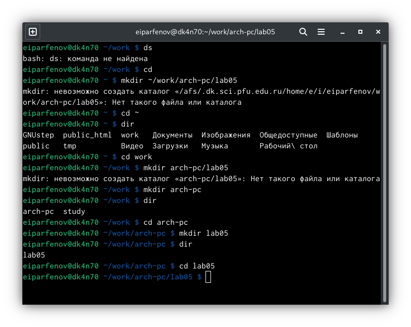{ #fig:001 width=70% }

2. Создал текстовый файл hello.asm. (рис. [-@fig:002])

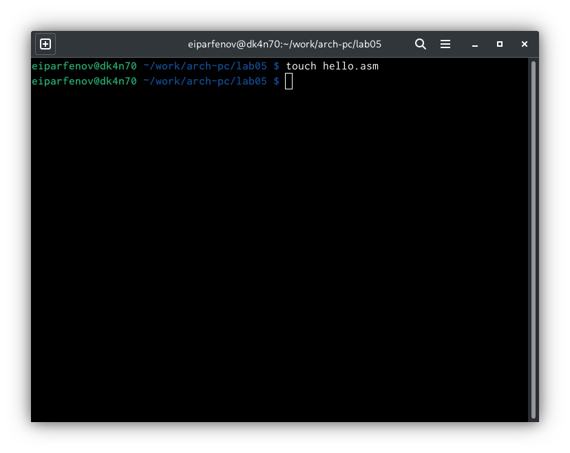{ #fig:002 width=70% } 

3. Открыл файл с помощью gedit. (рис. [-@fig:003]) 

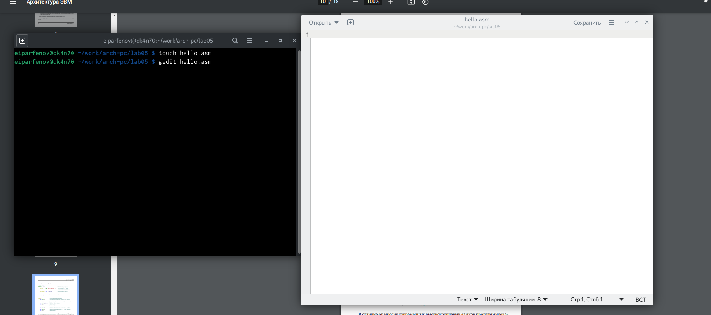{ #fig:003 width=70% }

4. Ввел в него предложенный текст. (рис. [-@fig:004]) 

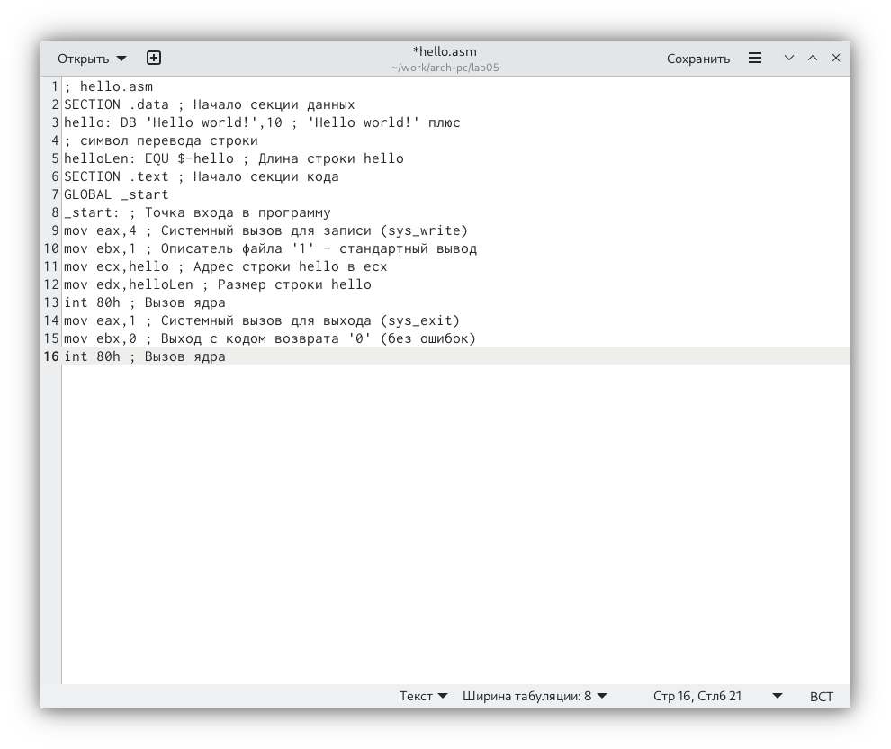{ #fig:004 width=70% }

5. Создал объектный файл heloo.o и проверил его наличие. (рис. [-@fig:005]) 

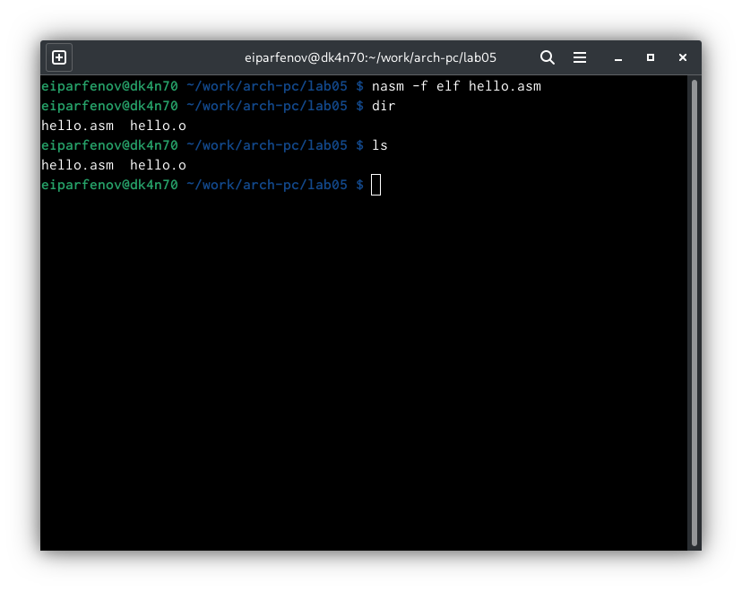{ #fig:005 width=70% }

6. Выполнил следующую команду и проверил правильность выполнения. (рис. [-@fig:006]) 

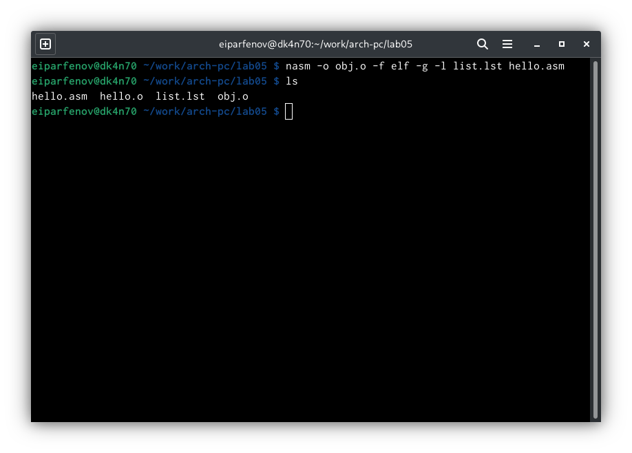{ #fig:006 width=70% }

7. Передал файл на обработку компоновщику и проверил, что он был создан. (рис. [-@fig:007]) 

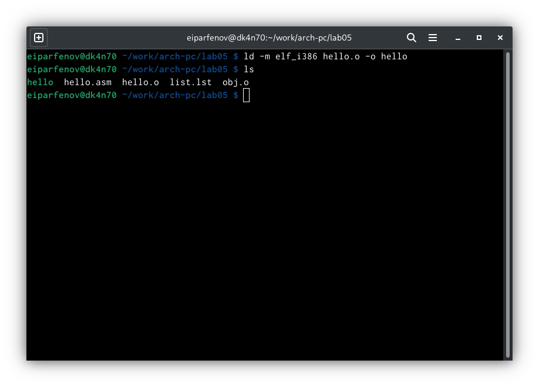{ #fig:007 width=70% }

8. Выполнил следущую команду, исполняемый файл имеет название main, объектный - obj. (рис. [-@fig:008]) 

{ #fig:008 width=70% }

9. Проверил. (рис. [-@fig:009])

{ #fig:009 width=70% }

# Выполнение самостоятельной  работы

10. Создал копию файла hello.asm с именем lab5.asm. (рис. [-@fig:010])

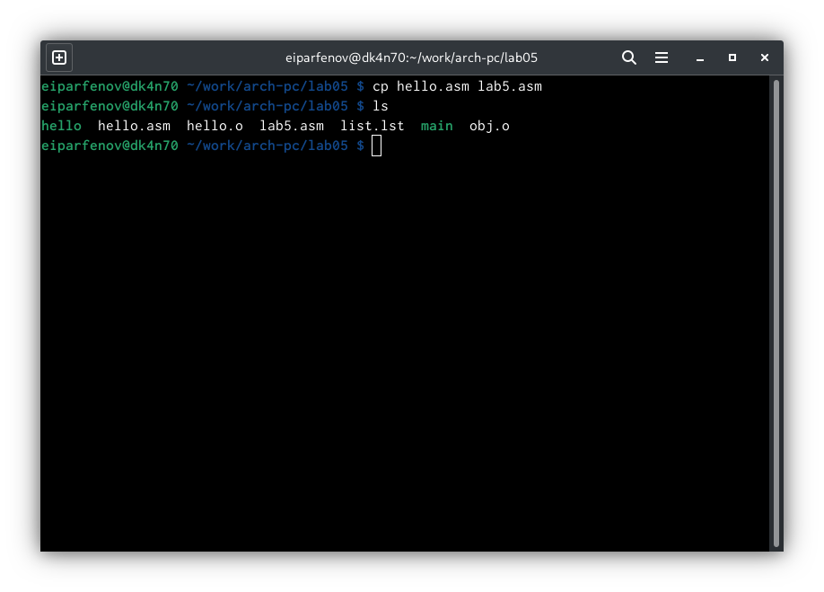{ #fig:010 width=70% }

11. С помощью gedit внес изменения в текст программы чтобы выводилась строка с моими фамилией и именем. (рис. [-@fig:011])

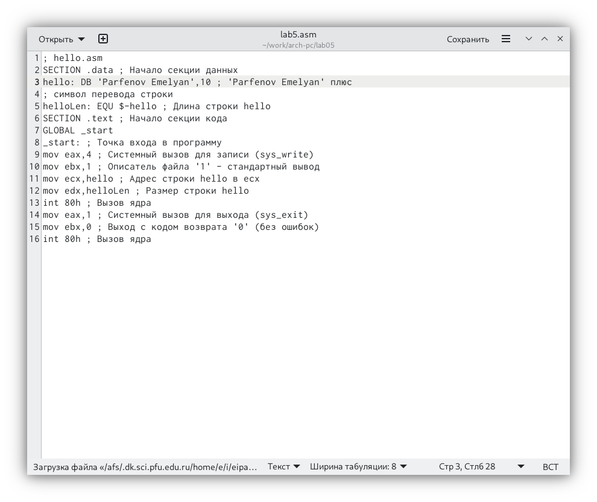{ #fig:011 width=70% }

12. Оттранслировал полученный текст в объектный файл. (рис. [-@fig:012])

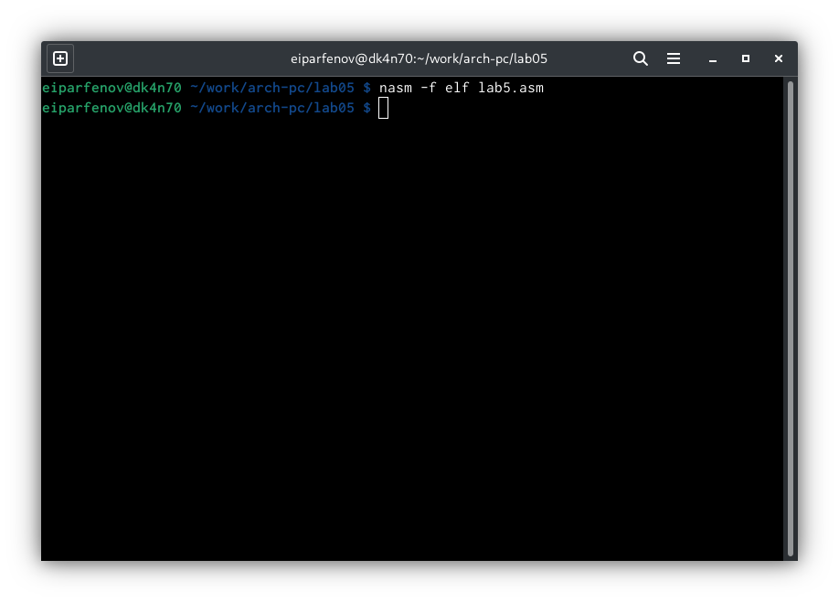{ #fig:012 width=70% }

13. Выполнил компоновку объектного файла. (рис. [-@fig:013])

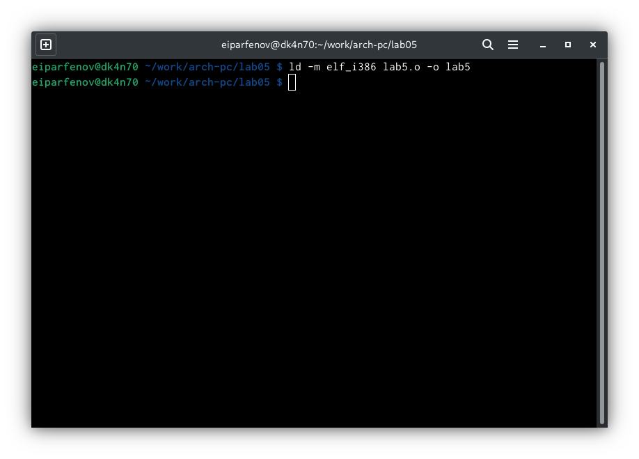{ #fig:013 width=70% }

14. Скопировал файлы в локальный репозиторий. (рис. [-@fig:014])

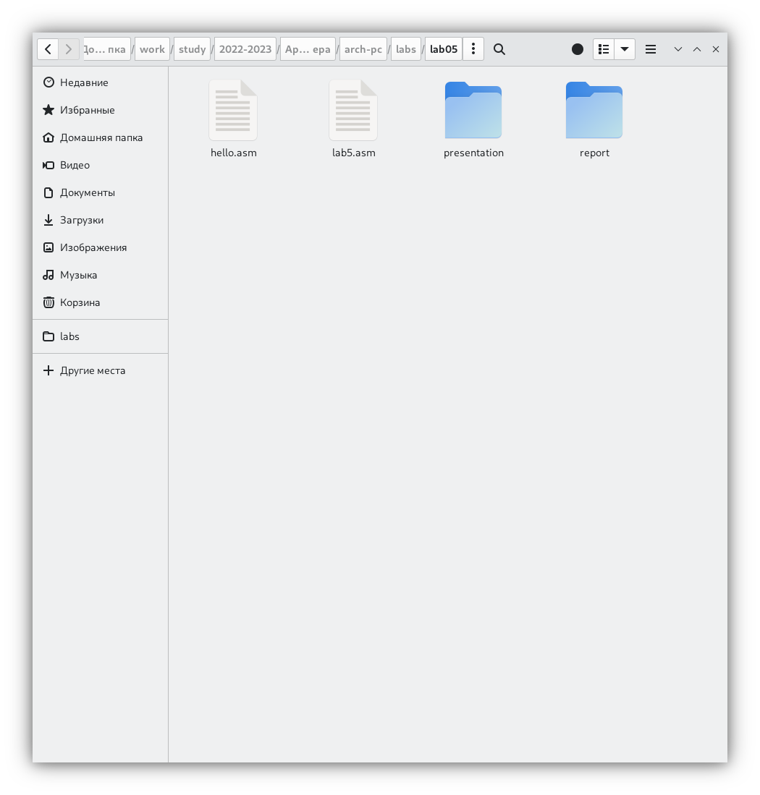{ #fig:014 width=70% }

15. Загрузил на гитхаб. (рис. [-@fig:015])

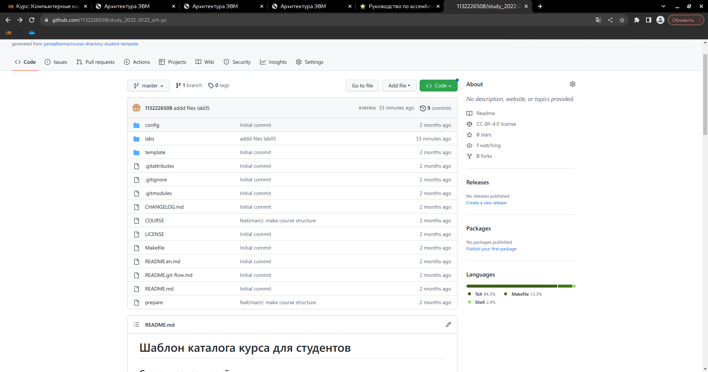{ #fig:015 width=70% }

# Выводы

Освоил процедуры компиляции и сборки программ, написанных на ассемблере NASM.

::: {#refs}
:::
